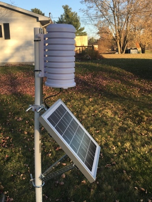

# Weather Station App

> Simple Web App to display and save data from a Personal Weather Station (PWS)

There are numerous projects for IoT devices ([Wikipedia](https://en.wikipedia.org/wiki/Internet_of_things)) out there to record and display their data. This is a very simple application for a single personal weather station. It is based on the popular [express.js](https://github.com/expressjs) and [React](https://react.dev/) and is using a [SQLite](https://sqlite.org) database, since there are not very frequent write statements to be expected (~ every 5 min) and it is easy to maintain. Alternatively you can use a [MongoDB](https://www.mongodb.com/) database. The API and the data format are kept simple intentionally.

As of now, data for multiple devices can be recorded, but the view is set to one device only, but it is possible to implement changes for the view for multiple in the future.

## Weather Station



The data from this Weather Station project transmitted via WiFi using the data endpoint of this application.

About the Project: [ESP32 Weather Station](https://github.com/sebasstian23/ESP32-WeatherStation)

## Install

The application is simple to install. Just download the latest version from the releases or clone the GitHub repo. Install the application using `npm`.

```zsh
npm install
```

## Define Environment

The required parameters to setup the application are defined in the .env file. Before running the application for the first time, create a file in the applications root folder called `.env`. After that open the `.env` file and provide the following parameters before staring the application. Make sure you only use one type of database, so either use `DATABASE_FILE` or `MONGO_CONNECTION_STRING` (more below).

| Key                       | Parameter                                                                                              |
| ------------------------- | ------------------------------------------------------------------------------------------------------ |
| `DATABASE_FILE`           | Path and filename for the database file (default: `./db.sqlite`)                                       |
| `MONGO_CONNECTION_STRING` | URL to the connect to a MongoDB instance.                                                              |
| `API_TOKEN`               | Create a token that needs to be submitted with any API request                                         |
| `PAGE_TITLE_LOCATION`     | The title of the top header                                                                            |
| `DEVICE_ID`               | The device id of the data the app is supposed to display                                               |
| `DEVICE_DESCRIPTION`      | Short description of your weather station                                                              |
| `DEVICE_LOCATION`         | Station's location that appears in the dashboard's title                                               |
| `DEVICE_LONGITUDE`        | Station's longitude in decimal to calculate sunrise/sunset and show the location on the map            |
| `DEVICE_LATITUDE`         | Station's latitude in decimal to calculate sunrise/sunset and show the location on the map             |
| `DEVICE_ALTITUDE`         | Station's altitude in meters (decimal) to be displayed only                                            |
| `DEVICE_TIMEZONE`         | The timezone of the station's location (e.g. America/Detroit) to display the correct local time of day |
| `DEVICE_INACTIVITY`       | Display inactivity if the latest entry is older than the given value in minutes (default: `15`)        |
| `SITE_OBSERVATIONS_MAX`   | Maximum number of rows in the observations table                                                       |

If you want to create a save token, you can go to a website like <https://randomkeygen.com/>.

```zsh
### Database
DATABASE_FILE=./db.sqlite
MONGO_CONNECTION_STRING=mongodb://localhost:27017/myDatabase

### API Token
API_TOKEN=YOUR_ACCESS_KEY

### Page Title
PAGE_TITLE_LOCATION=Lansing, MI

### Device Parameters
DEVICE_ID=Device 01
DEVICE_DESCRIPTION=My Backyard
DEVICE_LATITUDE=42.331389
DEVICE_LONGITUDE=-83.045833
DEVICE_ALTITUDE=185.0
DEVICE_TIMEZONE=America/Detroit
DEVICE_INACTIVITY=15

### App Configuration
SITE_OBSERVATIONS_MAX=20
```

## Select Database

The application supports two types of databases, [SQLITE](https://www.sqlite.org/) and [MongoDB](https://www.mongodb.com/). When setting up the environmental variables either use `DATABASE_FILE` or `MONGO_CONNECTION_STRING`, not both.

## Start the Application

Start the application locally by running the following command. The application is run using `nodemon`, so the server automatically restarts every time changes are made. When deployed `npm start` is used instead.

```zsh
npm run dev
```

The local version of the database will be available at `http://localhost:3000`.

## REST API

### Data Count

**GET:** `/data?token=YOUR_ACCESS_KEY`

```JavaScript
{
    "message": "success",
    "details": "Currently there are »123« datasets from device »Device ID«.",
    "body": {
        "count": 123
    }
}
```

### List Devices

**GET:** `/data/devices?token=YOUR_ACCESS_KEY`

```JavaScript
{
    "message": "success",
    "details": "There are »2« devices available.",
    "body": [
        {
            "device": "Device 01"
        },
        {
            "device": "Device 02"
        },
        ...
    ]
}
```

### Latest Dataset

**GET:** `/data/latest?token=YOUR_ACCESS_KEY`

```JavaScript
{
	"message": "success",
	"details": "Latest dataset »123« from device »Device 01« at »November 16, 2020 1:20 PM«.",
	"body": {
		"ID": 123,
		"device_id": "Device 01",
		"created_at": "2020-11-16T18:20:51.289Z",
        ...
	}
}
```

### Specific Dataset

**GET:** `/data/123?token=YOUR_ACCESS_KEY`

```JavaScript
{
	"message": "success",
	"details": "Dataset for ID »123« returned.",
	"body": {
		"ID": 123,
		"device_id": "Device 01",
		"created_at": "2020-11-16T18:20:51.289Z",
        ...
	}
}
```

### Contribute Dataset

**POST:** `/data`

**Content-Type:** `application/json; charset=utf-8`

```JavaScript
{
	"token": "Your Token",
	"data": {
		"device_id": "Device 01",
        ...
	}
}
```

#### Response

```JavaScript
{
    "message": "success",
    "details": "Dataset saved with ID »123«.",
    "body": {
        "ID": 123
    }
}
```
